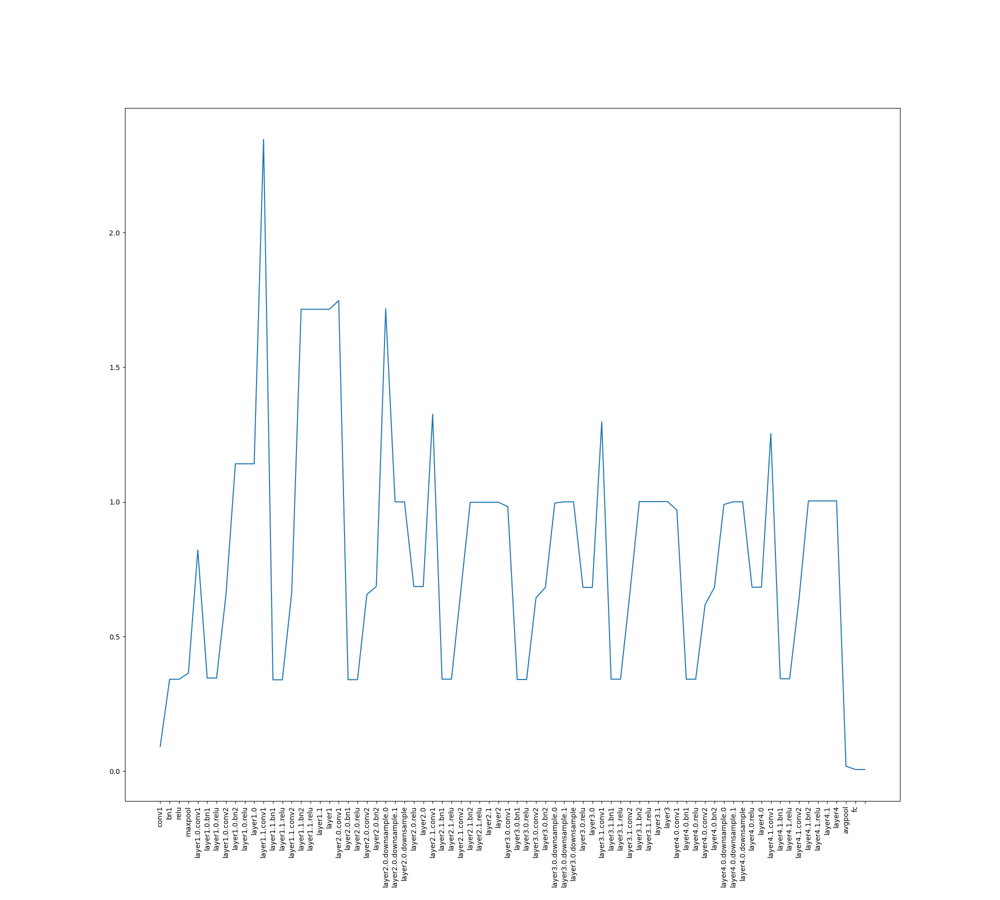

# Signal Propagation Plot (SPP) library

This code is based on signal propagation plots used in [Brock et al., 2021](https://arxiv.org/abs/2101.08692).
The goal of signal propagation plots (SPPs) is to visualize
the propagation of the activations across the layers
of a neural network, especially in the beginning of training (initialization). 
Ideally we would like the distribution of the activations to be have centered
mean and unit variance. When the neural network is not initialized correctly, we
can observe problems such as mean shift, or explosion of the variance,
as we go in the depth direction.

## How to use it for PyTorch ?

The following is a snippet on how to do it in PyTorch, where we apply
it to the `ResNet-18` initialized randomly.
Following [Brock et al., 2021](https://arxiv.org/abs/2101.08692), there are
two kinds of values that can be visualized for each, the average channel variance
and the average channel squared mean.

```python
import torch
from signal_propagation_plot.pytorch import get_average_channel_variance_by_depth
from signal_propagation_plot.pytorch import get_average_channel_squared_mean_by_depth
from signal_propagation_plot.pytorch import plot
import torchvision
import matplotlib.pyplot as plt
model = torchvision.models.resnet18()
x = torch.randn(64,3,224,224)
values = get_average_channel_variance_by_depth(model, x)
fig = plt.figure(figsize=(20, 18))
plot(values)
plt.savefig("plot.png")
```




## How to use it for TensorFlow ?

TODO
